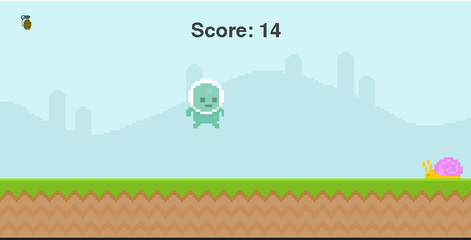
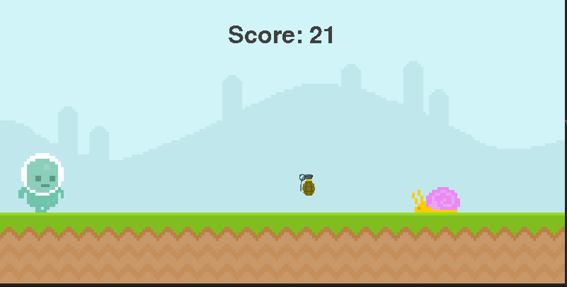

# PyGame
This repo was created for PyGame learning and practicing

## How to use
1. Make sure you have pygame installed on your computer or install it using `pip install pygame`.
2. Clone this repo using `git clone` and go to the main directory PyGame
3. Copy the `py` file from repo `xth game` to the main directory `PyGame`
4. Run the `py` file of the chosen game (for example: `python Juggle.py`)
5. Enjoy!

## First game
The first game is based on a YT tutorial for pygame you can find it in the following link: https://www.youtube.com/watch?v=AY9MnQ4x3zk
Notice that the game is not the exact same and some ideas of my own were added.

## Second game
The second game is a juggle game where you can control each hand and can't let a ball fall.
This game was not based on any video or guide and implemented in order to practice and test what I learnd from the first game.

https://github.com/finziamit/PyGame/assets/104727614/f4ca31cb-4692-4a3b-875a-144493851d4f

